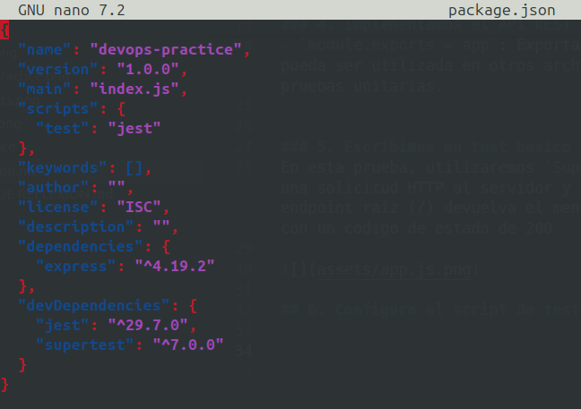

# 1. Inicializacion del proyecto de node.js 
### 1. Creamos la carpeta 
con el comando `mkdir devops-practice` 
y luego entramos al archivo con el comando `cd devops-practice`


### 2. Dentro de la carpeta ejecutamos el comando `npm init -y`

 

### 3. Creamos la estructura de la carpeta del proyecto 
Creamos con el comando `touch src/app.js tests/app.test.j`


### 4. Implementamos el API REST en src/app.js
para implementar el APPI REST, modificamos con el comando `nano src/app.js`


- `express`: Importa el framework Express para crear la aplicación.
- `app.get('/')`: Define una ruta GET en el endpoint raíz (/) que responde con el texto "Hello, World!".
- `app.listen(port, ...)`: Inicia el servidor en el puerto especificado.
- `module.exports = app`: Exporta la aplicación para que pueda ser utilizada en otros archivos, como en las pruebas unitarias.


### 5. Escribimos un test basico 
En esta prueba, utilizaremos `Supertest`  para realizar una solicitud HTTP al servidor y verificar que el endpoint raíz (/) devuelva el mensaje `"Hello, World!"` con un codigo de estado de 200


### 6. Configura el script de test en `package.json`
1. Se modifica el archivo `package.json` para agregar el script de pruebas y las dependencias:


- `"scripts": { "test": "jest" }`: Define un script para ejecutar las pruebas utilizando Jest.
- `"dependencies"`: Contiene las dependencias necesarias para que la aplicación funcione.
- `"devDependencies"`: Incluye las dependencias que solo son necesarias durante el desarrollo.

para ejecutar la prueba utiliza:
- `npm test `


#  Pipeline CI/CD
## 1. Crea un archivo de configuración para GitHub Actions:
### 1. Creamos la estructura para GitHub Actions:

```
mkdir -p .github/workflows
touch .github/workflows/ci.yml
```

#### 2. Definimos el flujo de trabajo en .github/workflows/ci.yml


- `name`: Define el nombre del flujo de trabajo.
- `on`: Especifica los eventos que activarán el flujo de trabajo, como `push` y `pull_request` en la rama main.
- `jobs`: Define los trabajos a realizar en el flujo de trabajo.
- `runs-on`: Define el sistema operativo en el que se ejecutarán los trabajos (ubuntu-latest en este caso).
- `steps`: Lista los pasos del trabajo.

## 2. Configuracion de entrega continua (CD) con Docker

### 1. Creamos un archivo Dockerfile, con el comando `nano Dockerfile`


- `FROM node:14`: Usa la imagen oficial de Node.js, versión 14, como base.
- `WORKDIR /app`: Establece el directorio de trabajo dentro del contenedor como `/app`.
- `COPY package*.json ./`: Copia los archivos package.json y package-lock.json al contenedor.
- `RUN npm install`: Ejecuta npm install para instalar las dependencias.
- `COPY . .`: Copia el resto del código de la aplicación en el directorio de trabajo del contenedor.
- `EXPOSE 3000`: Expone el puerto 3000, que será el puerto en el que la aplicación escuchará.
CMD ["node", "src/app.js"]: Ejecuta la aplicación con node src/app.js al iniciar el contenedor.

### 2. Construimos la imagen de Docker:
 ```docker build -t devops-practice .```

 

### 3. Corremos el contenedor localmente:

 ```docker run -p 3000:3000 devops-practice```

 


 ## Automatizacion de la configuración y gestión del entorno local usando Docker Compose

### 1. creamo un archivo docker-compose.yml con el comando 
```nano docker-compose.yml```


### 2.Corre la aplicación usando Docker Compose:

 ```docker-compose up --build -d```

 


