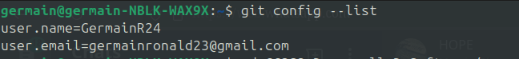
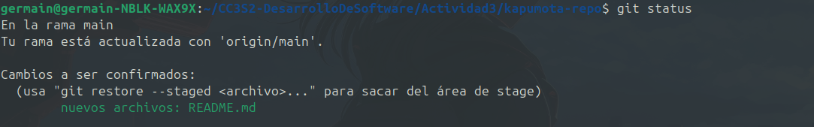

# INTRODUCCION A GIT
con el comando `git config --list` 


## creamos la carpeta kapumota-repo


## Preparando codigo
1. creamo un archivo README.md con el comando `echo "REDAME">README.md`


2. luego con el comando `git add README.md`preparamos el codigo o archivo para ser incluidos en el proximo commit 


## git status
muestra el estado actual de nuestro repositorio 
```git status```


## Registrar cambios
registramos los cambios que se a preparado con el git add .


## git push
1. con el comando `git push -u origin main` subimos los commits locales de la rama main al repositorio remoto origi

2. luego verificamos como esta el estado de nuestro repositorio


## Recorrer el arbol de commits
con el comando `git log` muestra una lista de commits realizados, primero se muestra el commit mas reciente


## ¿cual es la salida de este comando?
`git log --graph --pretty=format:'%x09 %h %ar ("%an") %s`

- `--graph`: Muestra una representación gráfica del historial de commits con una línea que indica las ramas y los merges.

- `--pretty=format`:'%x09 %h %ar ("%an") %s': Define el formato de salida de cada commit. Los componentes son:

    - `%x09`: Un carácter de tabulación horizontal, que añade espacio de separación.
    - `%h`: El hash abreviado del commit.
    - `%ar`: La fecha del commit en formato relativo (por ejemplo, "2 days ago").
    - `("%an")`: El nombre del autor del commit entre paréntesis.
    - `%s`: El mensaje del commit.


    